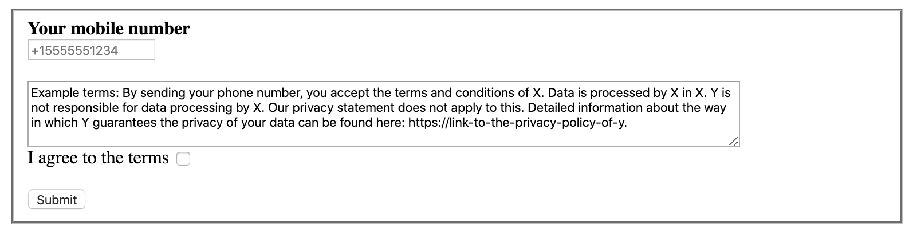

# Flow.ai Node.js Messaging Opt-in Example

This project showcases an example how to opt-in customers for receiving a message based on a phone number (MSISDN). This can be used for example to allow customers with desktop computers to continue a conversation on their mobile phone.



## How it works

This example runs a simple webserver that hosts a form. A user can submit a valid phone number to trigger an event. 

The Flow.ai [REST API](https://flow.ai/docs/api-docs/#rest-api) is then used to trigger an event for this specific MSISDN.

## Pre-requirements

- You'll need a working [Flow.ai account](https://flow.ai)
- You'll need a pro or enterprise plan
- Your project requires to have a working WhatsApp, MessageMedia, Twilio or RCS messaging channel

## Getting started

### Configure Flow.ai

- Login to [Flow.ai](https://app.flow.ai) and choose the project you'd like to connect
- Go to the [organisation settings](https://app.flow.ai/default/settings/organisation/tokens) and add a new API key if you do not have one
- Next return to the project and the [integrations](https://app.flow.ai/default/integrations) overview
- Add a REST API integration and configure the REST API

### Configure and run

#### 1. Install [Node.js](https://nodejs.org)

#### 2. Clone this repo and install packages

Open a terminal window and clone this repo inside a local folder

```bash
git clone https://github.com/flow-ai/flowai-messaging-optin-example.git
cd flowai-messaging-optin-example
yarn
```

#### 3. Add a `.env` configuration file

Create a file named `.env` inside the folder you cloned the project and add the following content:

```bash
API_TOKEN="Copy and paste the token from the REST API configuration"
CHANNEL_NAME="This depends on the integration (see table below)"
CHANNEL_EXTERNAL_ID="This depends on the integration (see table below)"
EVENT_NAME="Choose an event name to trigger"
```

#### 4. Change the configuration data

##### API_TOKEN

You can copy the token from the REST API configuration settings within the Flow.ai Dashboard. Add the token inside the `.env` file you just created.

##### CHANNEL_NAME

Use the reference table below to determine the `CHANNEL_NAME` to copy and paste:

| Channel | CHANNEL_NAME |
|------------|--------------|
| Google RBM | `rbm` |
| MessageMedia | `messagemedia` |
| Telekom RBM | `telekom` |
| Twilio | `twilio` |
| WhatsApp | `whatsapp` |

##### CHANNEL_EXTERNAL_ID

Within the Flow.ai dashboard, open the messaging channel you'd like to use to send a message. Use the reference table below to find the value to copy and paste.

| Channel | CHANNEL_EXTERNAL_ID (copy value from field) |
|------------|--------------|
| Google RBM | Project ID |
| MessageMedia | Phone Number |
| Telekom RBM | Telekom bot ID |
| Twilio | Phone Number |
| WhatsApp | Production phone number |

##### EVENT_NAME

This can be any [event](https://flow.ai/docs/replies/event) you configured within your flows. Simply add the name of the event you'd like to trigger.

#### 3. Running locally

Open the terminal and run `yarn start`

The server will run on http://localhost:8080

### 4. Deploy online

You can run this example in different ways, but one of the easiest is Heroku. Make sure you have all the necessary information including token, channel name and external ID when you install it.

**Deploy to heroku**

[](https://heroku.com/deploy)

